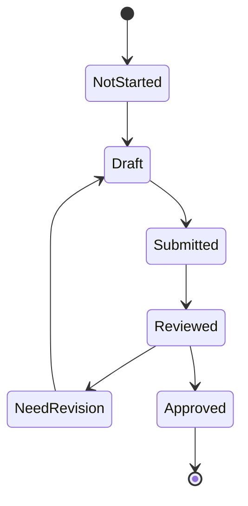
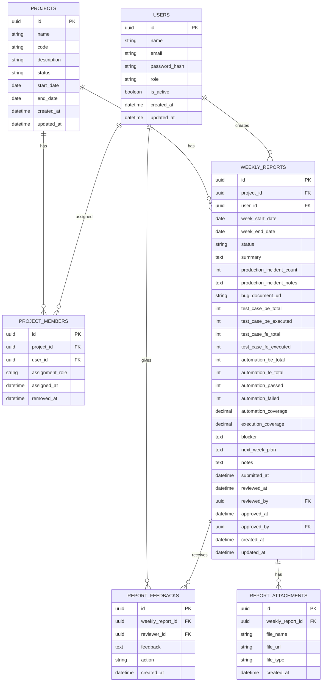

# PRD QA Member Management App

## 1. Ringkasan Produk

Aplikasi ini dibuat untuk membantu QA Lead atau QA Manager memantau pekerjaan QA member secara terstruktur.

Fokus utama aplikasi:

- Mengelola QA member.
- Mengelola project aktif.
- Mengatur assignment QA ke project.
- Membuat weekly report.
- Review report oleh QA Lead.
- Membuat summary untuk monthly report.
- Melihat dashboard progress QA per project dan per member.

Target awal aplikasi adalah internal team QA.

---

## 2. Masalah yang Ingin Diselesaikan

Saat ini laporan QA biasanya tersebar di banyak tempat, seperti Google Sheet, chat, Slack, dokumen manual, atau laporan terpisah.

Masalah yang sering muncul:

- QA Lead sulit melihat progress semua member dalam satu tempat.
- Weekly report tidak konsisten formatnya.
- Data automation coverage sulit dihitung ulang.
- Bug, test case, blocker, dan next plan tidak terdokumentasi rapi.
- Monthly report butuh rekap manual.
- Sulit melihat kontribusi tiap QA member per project.

---

## 3. Tujuan Produk

Aplikasi ini harus membantu QA Lead untuk:

- Melihat status weekly report semua QA member.
- Melihat project mana yang sedang aktif.
- Melihat QA member yang assigned ke project tertentu.
- Review report QA member.
- Melihat summary test case, automation, bug, incident, dan blocker.
- Generate monthly report dari weekly report.
- Mengurangi pekerjaan rekap manual.

---

## 4. Target User

### 4.1 QA Member

QA member memakai aplikasi untuk:

- Melihat project yang assigned ke dirinya.
- Mengisi weekly report.
- Menyimpan report sebagai draft.
- Submit report untuk direview.
- Melihat feedback dari QA Lead.
- Revisi report jika diminta.

### 4.2 QA Lead / QA Manager

QA Lead memakai aplikasi untuk:

- Mengelola project.
- Assign QA member ke project.
- Review weekly report.
- Melihat dashboard summary.
- Generate monthly report.
- Memberi feedback ke QA member.

### 4.3 Admin

Admin memakai aplikasi untuk:

- Mengelola user.
- Mengatur role user.
- Mengelola master data.
- Menonaktifkan user jika sudah tidak aktif.

---

## 5. Scope MVP

MVP fokus pada fitur utama yang langsung berguna untuk operasional QA.

### 5.1 Fitur MVP

1. Authentication
2. User management
3. Role management
4. Project management
5. Assign QA member ke project
6. Weekly report form
7. Draft dan submit weekly report
8. Review weekly report
9. Feedback dan revision flow
10. Dashboard summary
11. Monthly report summary
12. Export report ke Markdown atau PDF

### 5.2 Out of Scope MVP

Fitur berikut tidak wajib masuk MVP pertama:

- Integrasi Jira.
- Integrasi GitLab.
- Integrasi Jenkins.
- Integrasi Slack otomatis.
- AI summary.
- Realtime notification.
- Advanced chart.
- Timesheet detail per hari.
- Mobile app native.

---

## 6. Role dan Permission

| Fitur | QA Member | QA Lead | Admin |
|---|---:|---:|---:|
| Login | Yes | Yes | Yes |
| Lihat assigned project | Yes | Yes | Yes |
| Buat weekly report | Yes | Yes | No |
| Edit draft report sendiri | Yes | Yes | No |
| Submit report | Yes | Yes | No |
| Review report | No | Yes | No |
| Request revision | No | Yes | No |
| Approve report | No | Yes | No |
| Kelola project | No | Yes | Yes |
| Assign member ke project | No | Yes | Yes |
| Kelola user | No | No | Yes |
| Lihat semua dashboard | No | Yes | Yes |
| Export report | Limited | Yes | Yes |

---

## 7. Status Weekly Report

Weekly report memiliki status berikut:

| Status | Penjelasan |
|---|---|
| Not Started | Report belum dibuat |
| Draft | Report sudah dibuat tapi belum disubmit |
| Submitted | Report sudah disubmit oleh QA member |
| Reviewed | Report sudah dicek oleh QA Lead |
| Need Revision | QA Lead meminta revisi |
| Approved | Report sudah final |

### 7.1 Flow Status



---

## 8. Main Workflow

### 8.1 Workflow QA Member

1. QA Member login.
2. QA Member masuk ke dashboard.
3. QA Member melihat project aktif yang assigned ke dirinya.
4. QA Member memilih project.
5. QA Member memilih week report.
6. QA Member mengisi form weekly report.
7. QA Member klik Save Draft.
8. QA Member klik Submit.
9. QA Lead review report.
10. Jika perlu revisi, QA Member memperbaiki report.
11. Jika approved, report masuk ke monthly summary.

### 8.2 Workflow QA Lead

1. QA Lead login.
2. QA Lead melihat dashboard team.
3. QA Lead melihat daftar project aktif.
4. QA Lead melihat report yang statusnya Submitted.
5. QA Lead membuka detail report.
6. QA Lead memberi feedback.
7. QA Lead memilih:
   - Mark as Reviewed
   - Request Revision
   - Approve
8. QA Lead melihat monthly summary.
9. QA Lead export report jika dibutuhkan.

---

## 9. Struktur Weekly Report

### 9.1 Field Utama

| Field | Tipe | Wajib | Keterangan |
|---|---|---:|---|
| Project | Select | Yes | Project yang sedang direport |
| Week Start Date | Date | Yes | Tanggal awal minggu |
| Week End Date | Date | Yes | Tanggal akhir minggu |
| Summary | Textarea | Yes | Ringkasan pekerjaan minggu ini |
| Production Incident | Number | Yes | Jumlah incident production |
| Production Incident Notes | Textarea | No | Detail incident |
| Bug Document URL | URL | No | Link dokumen bug |
| Test Case BE Total | Number | Yes | Total test case backend |
| Test Case BE Executed | Number | Yes | Test case backend yang dieksekusi |
| Test Case FE Total | Number | Yes | Total test case frontend |
| Test Case FE Executed | Number | Yes | Test case frontend yang dieksekusi |
| Automation BE Total | Number | Yes | Total automation backend |
| Automation FE Total | Number | Yes | Total automation frontend |
| Automation Passed | Number | No | Total automation passed |
| Automation Failed | Number | No | Total automation failed |
| Blocker | Textarea | No | Kendala utama |
| Next Week Plan | Textarea | Yes | Rencana minggu depan |
| Notes | Textarea | No | Catatan tambahan |

### 9.2 Field Otomatis

| Field | Formula |
|---|---|
| Total Test Case | Test Case BE Total + Test Case FE Total |
| Total Executed Test Case | Test Case BE Executed + Test Case FE Executed |
| Total Automation | Automation BE Total + Automation FE Total |
| Automation Coverage | Total Automation / Total Test Case * 100 |
| Execution Coverage | Total Executed Test Case / Total Test Case * 100 |
| Automation Pass Rate | Automation Passed / Total Automation Run * 100 |

### 9.3 Validasi Form

- Week Start Date harus lebih kecil dari Week End Date.
- Total executed tidak boleh lebih besar dari total test case.
- Automation total tidak boleh lebih besar dari total test case.
- URL harus valid jika diisi.
- Next Week Plan wajib diisi sebelum submit.
- Summary wajib diisi sebelum submit.
- Report tidak bisa diedit setelah Approved.

---

## 10. Dashboard

### 10.1 Dashboard QA Member

QA Member melihat:

- Total assigned project.
- Report minggu ini.
- Status report per project.
- Report yang perlu revisi.
- History report.
- Next week plan sebelumnya.

### 10.2 Dashboard QA Lead

QA Lead melihat:

- Total active project.
- Total QA member aktif.
- Jumlah report Not Started.
- Jumlah report Draft.
- Jumlah report Submitted.
- Jumlah report Need Revision.
- Jumlah report Approved.
- Summary production incident.
- Summary blocker.
- Automation coverage per project.
- Test case execution coverage per project.

### 10.3 Contoh Widget Dashboard

| Widget | Penjelasan |
|---|---|
| Active Projects | Jumlah project aktif |
| Pending Review | Report yang menunggu review |
| Need Revision | Report yang perlu diperbaiki |
| Production Incident | Total incident minggu ini |
| Automation Coverage | Rata-rata automation coverage |
| Top Blockers | Blocker yang paling sering muncul |

---

## 11. Halaman Aplikasi

### 11.1 Auth

- Login page
- Logout
- Forgot password, optional untuk MVP

### 11.2 Dashboard

- Dashboard QA Member
- Dashboard QA Lead
- Dashboard Admin

### 11.3 User Management

- List user
- Add user
- Edit user
- Deactivate user
- Assign role

### 11.4 Project Management

- List project
- Add project
- Edit project
- Archive project
- Assign QA member

### 11.5 Weekly Report

- List weekly report
- Create report
- Edit draft report
- Submit report
- Review report
- Request revision
- Approve report
- View report history

### 11.6 Monthly Report

- Select month
- Select project
- View summary
- Export summary

---

## 12. ERD



---

## 13. Database Schema Draft

### 13.1 users

| Column | Type | Required | Notes |
|---|---|---:|---|
| id | uuid | Yes | Primary key |
| name | varchar | Yes | Nama user |
| email | varchar | Yes | Unique |
| password_hash | text | Yes | Hash password |
| role | varchar | Yes | admin, qa_lead, qa_member |
| is_active | boolean | Yes | Default true |
| created_at | timestamp | Yes | Auto |
| updated_at | timestamp | Yes | Auto |

### 13.2 projects

| Column | Type | Required | Notes |
|---|---|---:|---|
| id | uuid | Yes | Primary key |
| name | varchar | Yes | Nama project |
| code | varchar | Yes | Unique project code |
| description | text | No | Detail project |
| status | varchar | Yes | active, archived |
| start_date | date | No | Tanggal mulai |
| end_date | date | No | Tanggal selesai |
| created_at | timestamp | Yes | Auto |
| updated_at | timestamp | Yes | Auto |

### 13.3 project_members

| Column | Type | Required | Notes |
|---|---|---:|---|
| id | uuid | Yes | Primary key |
| project_id | uuid | Yes | FK projects.id |
| user_id | uuid | Yes | FK users.id |
| assignment_role | varchar | Yes | qa_member, qa_pic |
| assigned_at | timestamp | Yes | Auto |
| removed_at | timestamp | No | Null jika masih aktif |

### 13.4 weekly_reports

| Column | Type | Required | Notes |
|---|---|---:|---|
| id | uuid | Yes | Primary key |
| project_id | uuid | Yes | FK projects.id |
| user_id | uuid | Yes | FK users.id |
| week_start_date | date | Yes | Awal periode |
| week_end_date | date | Yes | Akhir periode |
| status | varchar | Yes | draft, submitted, reviewed, need_revision, approved |
| summary | text | Yes | Ringkasan pekerjaan |
| production_incident_count | int | Yes | Default 0 |
| production_incident_notes | text | No | Detail incident |
| bug_document_url | text | No | URL dokumen bug |
| test_case_be_total | int | Yes | Default 0 |
| test_case_be_executed | int | Yes | Default 0 |
| test_case_fe_total | int | Yes | Default 0 |
| test_case_fe_executed | int | Yes | Default 0 |
| automation_be_total | int | Yes | Default 0 |
| automation_fe_total | int | Yes | Default 0 |
| automation_passed | int | No | Default 0 |
| automation_failed | int | No | Default 0 |
| automation_coverage | decimal | No | Auto calculated |
| execution_coverage | decimal | No | Auto calculated |
| blocker | text | No | Blocker minggu ini |
| next_week_plan | text | Yes | Plan minggu depan |
| notes | text | No | Catatan tambahan |
| submitted_at | timestamp | No | Saat submit |
| reviewed_at | timestamp | No | Saat review |
| reviewed_by | uuid | No | FK users.id |
| approved_at | timestamp | No | Saat approve |
| approved_by | uuid | No | FK users.id |
| created_at | timestamp | Yes | Auto |
| updated_at | timestamp | Yes | Auto |

### 13.5 report_feedbacks

| Column | Type | Required | Notes |
|---|---|---:|---|
| id | uuid | Yes | Primary key |
| weekly_report_id | uuid | Yes | FK weekly_reports.id |
| reviewer_id | uuid | Yes | FK users.id |
| feedback | text | Yes | Isi feedback |
| action | varchar | Yes | reviewed, need_revision, approved |
| created_at | timestamp | Yes | Auto |

---

## 14. API Endpoint Draft

Base URL:

```txt
/api
```

### 14.1 Auth

| Method | Endpoint | Fungsi |
|---|---|---|
| POST | /auth/login | Login |
| POST | /auth/logout | Logout |
| GET | /auth/me | Get current user |

### 14.2 Users

| Method | Endpoint | Fungsi |
|---|---|---|
| GET | /users | List user |
| GET | /users/:id | Detail user |
| POST | /users | Create user |
| PATCH | /users/:id | Update user |
| PATCH | /users/:id/deactivate | Deactivate user |

### 14.3 Projects

| Method | Endpoint | Fungsi |
|---|---|---|
| GET | /projects | List project |
| GET | /projects/:id | Detail project |
| POST | /projects | Create project |
| PATCH | /projects/:id | Update project |
| PATCH | /projects/:id/archive | Archive project |
| POST | /projects/:id/members | Assign member |
| DELETE | /projects/:id/members/:userId | Remove member |

### 14.4 Weekly Reports

| Method | Endpoint | Fungsi |
|---|---|---|
| GET | /weekly-reports | List weekly report |
| GET | /weekly-reports/:id | Detail weekly report |
| POST | /weekly-reports | Create draft report |
| PATCH | /weekly-reports/:id | Update draft report |
| POST | /weekly-reports/:id/submit | Submit report |
| POST | /weekly-reports/:id/review | Mark as reviewed |
| POST | /weekly-reports/:id/request-revision | Request revision |
| POST | /weekly-reports/:id/approve | Approve report |

### 14.5 Dashboard

| Method | Endpoint | Fungsi |
|---|---|---|
| GET | /dashboard/member | Dashboard QA member |
| GET | /dashboard/lead | Dashboard QA Lead |
| GET | /dashboard/project/:id | Dashboard project |

### 14.6 Monthly Reports

| Method | Endpoint | Fungsi |
|---|---|---|
| GET | /monthly-reports | Monthly summary |
| GET | /monthly-reports/export | Export monthly report |

---

## 15. UI Page Detail

### 15.1 Login Page

Komponen:

- Email input
- Password input
- Login button
- Error message

### 15.2 QA Member Dashboard

Komponen:

- Card assigned project
- Card report status minggu ini
- Table weekly report
- Button create report
- Button continue draft
- Button view feedback

### 15.3 QA Lead Dashboard

Komponen:

- Summary cards
- Report status chart
- Project table
- Pending review table
- Need revision table
- Incident summary
- Blocker summary

### 15.4 Project Detail Page

Komponen:

- Project information
- Assigned QA member
- Weekly report history
- Automation coverage trend
- Test case execution summary

### 15.5 Weekly Report Form

Section form:

1. Project dan periode
2. Summary pekerjaan
3. Production incident
4. Bug document
5. Test case BE
6. Test case FE
7. Automation BE
8. Automation FE
9. Blocker
10. Next week plan
11. Notes
12. Save Draft button
13. Submit button

### 15.6 Review Report Page

Komponen:

- Detail weekly report
- Calculated metrics
- Feedback history
- Feedback textarea
- Mark as reviewed button
- Request revision button
- Approve button

---

## 16. Monthly Report Summary

Monthly report diambil dari kumpulan weekly report yang statusnya Approved.

### 16.1 Filter

- Month
- Project
- QA Member
- Status

### 16.2 Data Summary

| Data | Sumber |
|---|---|
| Total production incident | Sum weekly_reports.production_incident_count |
| Total test case BE | Sum weekly_reports.test_case_be_total |
| Total test case FE | Sum weekly_reports.test_case_fe_total |
| Total automation BE | Sum weekly_reports.automation_be_total |
| Total automation FE | Sum weekly_reports.automation_fe_total |
| Average automation coverage | Average weekly_reports.automation_coverage |
| Average execution coverage | Average weekly_reports.execution_coverage |
| Blocker summary | Group from weekly_reports.blocker |
| Next plan summary | Group from weekly_reports.next_week_plan |

### 16.3 Output Monthly Report

Format export minimal:

```md
# Monthly QA Report

## Project
Nama Project

## Period
May 2026

## Summary
Ringkasan progress QA selama bulan ini.

## Metrics

| Metric | Value |
|---|---:|
| Production Incident | 0 |
| Test Case BE | 120 |
| Test Case FE | 180 |
| Automation BE | 80 |
| Automation FE | 90 |
| Automation Coverage | 56.67% |
| Execution Coverage | 92.00% |

## Blockers
- Blocker 1
- Blocker 2

## Next Month Plan
- Plan 1
- Plan 2
```

---

## 17. Rekomendasi Tech Stack

### 17.1 Frontend

- Next.js
- TypeScript
- Tailwind CSS
- Shadcn UI
- React Hook Form
- Zod

### 17.2 Backend

Opsi 1, simple full-stack:

- Next.js App Router
- Server Actions atau Route Handlers
- Prisma ORM
- PostgreSQL

Opsi 2, backend terpisah:

- Express.js
- Prisma ORM
- PostgreSQL
- JWT Auth

Rekomendasi untuk MVP:

- Pakai Next.js full-stack.
- Pakai PostgreSQL.
- Pakai Prisma.
- Pakai Shadcn UI.
- Deploy awal bisa di VPS atau home server via Docker.

### 17.3 Database

- PostgreSQL 16

### 17.4 Deployment

- Docker Compose untuk local dan server.
- Nginx Proxy Manager untuk reverse proxy.
- Cloudflare DNS untuk domain.
- Optional Tailscale untuk akses private.

---

## 18. Struktur Folder Rekomendasi

```txt
qa-management-app/
├── app/
│   ├── login/
│   ├── dashboard/
│   ├── projects/
│   ├── weekly-reports/
│   ├── monthly-reports/
│   └── api/
├── components/
│   ├── ui/
│   ├── dashboard/
│   ├── projects/
│   └── reports/
├── lib/
│   ├── auth.ts
│   ├── db.ts
│   ├── permissions.ts
│   └── report-calculator.ts
├── prisma/
│   └── schema.prisma
├── types/
│   └── index.ts
├── docker-compose.yml
├── .env.example
└── README.md
```

---

## 19. Prisma Schema Draft

```prisma
model User {
  id           String   @id @default(uuid())
  name         String
  email        String   @unique
  passwordHash String
  role         Role
  isActive     Boolean  @default(true)
  createdAt    DateTime @default(now())
  updatedAt    DateTime @updatedAt

  projectMembers ProjectMember[]
  weeklyReports  WeeklyReport[]
  feedbacks      ReportFeedback[] @relation("ReviewerFeedbacks")
}

model Project {
  id          String   @id @default(uuid())
  name        String
  code        String   @unique
  description String?
  status      ProjectStatus @default(ACTIVE)
  startDate   DateTime?
  endDate     DateTime?
  createdAt   DateTime @default(now())
  updatedAt   DateTime @updatedAt

  members       ProjectMember[]
  weeklyReports WeeklyReport[]
}

model ProjectMember {
  id             String   @id @default(uuid())
  projectId      String
  userId         String
  assignmentRole AssignmentRole @default(QA_MEMBER)
  assignedAt     DateTime @default(now())
  removedAt      DateTime?

  project Project @relation(fields: [projectId], references: [id])
  user    User    @relation(fields: [userId], references: [id])

  @@unique([projectId, userId])
}

model WeeklyReport {
  id                      String   @id @default(uuid())
  projectId               String
  userId                  String
  weekStartDate           DateTime
  weekEndDate             DateTime
  status                  ReportStatus @default(DRAFT)
  summary                 String
  productionIncidentCount Int      @default(0)
  productionIncidentNotes String?
  bugDocumentUrl          String?
  testCaseBeTotal         Int      @default(0)
  testCaseBeExecuted      Int      @default(0)
  testCaseFeTotal         Int      @default(0)
  testCaseFeExecuted      Int      @default(0)
  automationBeTotal       Int      @default(0)
  automationFeTotal       Int      @default(0)
  automationPassed        Int      @default(0)
  automationFailed        Int      @default(0)
  automationCoverage      Decimal? @db.Decimal(5, 2)
  executionCoverage       Decimal? @db.Decimal(5, 2)
  blocker                 String?
  nextWeekPlan            String
  notes                   String?
  submittedAt             DateTime?
  reviewedAt              DateTime?
  reviewedBy              String?
  approvedAt              DateTime?
  approvedBy              String?
  createdAt               DateTime @default(now())
  updatedAt               DateTime @updatedAt

  project Project @relation(fields: [projectId], references: [id])
  user    User    @relation(fields: [userId], references: [id])

  feedbacks   ReportFeedback[]
  attachments ReportAttachment[]

  @@unique([projectId, userId, weekStartDate, weekEndDate])
}

model ReportFeedback {
  id             String   @id @default(uuid())
  weeklyReportId String
  reviewerId     String
  feedback       String
  action         ReviewAction
  createdAt      DateTime @default(now())

  weeklyReport WeeklyReport @relation(fields: [weeklyReportId], references: [id])
  reviewer     User         @relation("ReviewerFeedbacks", fields: [reviewerId], references: [id])
}

model ReportAttachment {
  id             String   @id @default(uuid())
  weeklyReportId String
  fileName       String
  fileUrl        String
  fileType       String
  createdAt      DateTime @default(now())

  weeklyReport WeeklyReport @relation(fields: [weeklyReportId], references: [id])
}

enum Role {
  ADMIN
  QA_LEAD
  QA_MEMBER
}

enum ProjectStatus {
  ACTIVE
  ARCHIVED
}

enum AssignmentRole {
  QA_MEMBER
  QA_PIC
}

enum ReportStatus {
  DRAFT
  SUBMITTED
  REVIEWED
  NEED_REVISION
  APPROVED
}

enum ReviewAction {
  REVIEWED
  NEED_REVISION
  APPROVED
}
```

---

## 20. Business Rules

### 20.1 Report Creation

- QA Member hanya bisa membuat report untuk project yang assigned ke dirinya.
- QA Member hanya bisa punya satu report untuk project dan week yang sama.
- QA Member bisa save draft berkali-kali.
- QA Member tidak bisa submit jika field wajib belum lengkap.

### 20.2 Report Review

- QA Lead bisa review semua report.
- QA Lead bisa memberi feedback.
- QA Lead bisa request revision.
- QA Lead bisa approve report.
- Report yang sudah approved tidak bisa diedit oleh QA Member.

### 20.3 Project Assignment

- Satu project bisa punya banyak QA member.
- Satu QA member bisa assigned ke banyak project.
- Member yang removed dari project tidak bisa membuat report baru untuk project tersebut.
- History report tetap tersimpan meskipun member sudah removed.

### 20.4 Calculation Rules

Automation coverage:

```txt
total_automation = automation_be_total + automation_fe_total
total_test_case = test_case_be_total + test_case_fe_total
automation_coverage = total_automation / total_test_case * 100
```

Execution coverage:

```txt
total_executed = test_case_be_executed + test_case_fe_executed
total_test_case = test_case_be_total + test_case_fe_total
execution_coverage = total_executed / total_test_case * 100
```

Jika total_test_case = 0, maka coverage = 0.

---

## 21. Notification Draft

Untuk MVP, notification bisa tampil di dalam aplikasi.

### 21.1 Notification Event

| Event | Receiver |
|---|---|
| Report submitted | QA Lead |
| Report need revision | QA Member |
| Report approved | QA Member |
| Member assigned to project | QA Member |
| Project archived | Assigned member |

### 21.2 Future Integration

- Slack notification
- Email notification
- Telegram notification

---

## 22. Acceptance Criteria MVP

### 22.1 Authentication

- User bisa login dengan email dan password.
- User diarahkan ke dashboard sesuai role.
- User tidak bisa akses halaman tanpa login.

### 22.2 Project Management

- QA Lead bisa membuat project.
- QA Lead bisa edit project.
- QA Lead bisa archive project.
- QA Lead bisa assign QA member ke project.

### 22.3 Weekly Report

- QA Member bisa membuat draft report.
- QA Member bisa submit report.
- QA Member bisa melihat status report.
- QA Member bisa revisi report jika status Need Revision.
- QA Member tidak bisa edit report yang Approved.

### 22.4 Review Report

- QA Lead bisa melihat report Submitted.
- QA Lead bisa memberi feedback.
- QA Lead bisa request revision.
- QA Lead bisa approve report.

### 22.5 Dashboard

- QA Member bisa melihat report miliknya.
- QA Lead bisa melihat summary semua report.
- Dashboard menampilkan status report dengan benar.

### 22.6 Monthly Report

- QA Lead bisa pilih bulan dan project.
- Sistem menampilkan summary dari report Approved.
- Sistem bisa export summary minimal ke Markdown.

---

## 23. Development Phase

### Phase 1: Foundation

- Setup project Next.js.
- Setup Tailwind dan Shadcn UI.
- Setup PostgreSQL.
- Setup Prisma.
- Setup authentication.
- Setup role guard.

### Phase 2: Core Data

- User management.
- Project management.
- Project member assignment.
- Basic dashboard.

### Phase 3: Weekly Report

- Weekly report form.
- Save draft.
- Submit report.
- Status report.
- Validation.

### Phase 4: Review Flow

- Review page.
- Feedback.
- Request revision.
- Approve report.

### Phase 5: Reporting

- Monthly summary.
- Export Markdown.
- Export PDF optional.
- Dashboard metric refinement.

### Phase 6: Integration

- Slack notification.
- Email notification.
- Jenkins report link.
- Jira integration.
- GitLab integration.

---

## 24. MVP Prioritas Build

Urutan pengerjaan yang paling aman:

1. Database schema
2. Login dan role guard
3. Project CRUD
4. User CRUD
5. Assign member ke project
6. Weekly report CRUD
7. Submit flow
8. Review flow
9. Dashboard summary
10. Monthly summary
11. Export report

---

## 25. Contoh Seed Data

### Users

| Name | Email | Role |
|---|---|---|
| Jopa | jopa@example.com | QA_LEAD |
| QA Member 1 | qa1@example.com | QA_MEMBER |
| QA Member 2 | qa2@example.com | QA_MEMBER |

### Projects

| Name | Code | Status |
|---|---|---|
| UHealth Frontend | UHF | ACTIVE |
| UHealth Backend | UHB | ACTIVE |
| Automation Pipeline | AUTOPIPE | ACTIVE |

---

## 26. Future Improvement

Fitur lanjutan yang bisa ditambahkan setelah MVP:

- AI summary untuk monthly report.
- Import report dari JSON Cucumber.
- Integrasi Jenkins build result.
- Integrasi k6 result.
- Integrasi Jira bug count.
- Integrasi GitLab MR activity.
- Trend chart automation coverage.
- Team performance dashboard.
- Reminder otomatis untuk report yang belum submit.
- Approval multi-level.
- Export Excel.
- Audit log detail.
- SSO Google Workspace.

---

## 27. Catatan untuk AI Coding Agent

Saat implementasi, prioritaskan:

- Code sederhana dan mudah dirawat.
- Validasi kuat di frontend dan backend.
- Permission check di semua endpoint.
- Hindari overengineering di MVP.
- Gunakan enum untuk role dan status.
- Simpan angka mentah di database.
- Hitung coverage saat save report.
- Jangan hanya hitung coverage di frontend.
- Buat reusable component untuk table, form, status badge, dan metric card.
- Buat seed data agar aplikasi mudah dites.
- Buat README setup local dari awal.

---

## 28. Implementation Status (snapshot)

PRD versi: `v1.1 — 2026-05-29`.

| Item | Status | Catatan |
|---|---|---|
| Next.js + TS + Tailwind scaffold | Done | Next 16, React 19, Tailwind v4 |
| UI components shadcn-style | Done | Custom, bukan dari Shadcn CLI |
| ORM + DB | Done | Drizzle ORM (replace Prisma) |
| Database | Done | PostgreSQL homeserver, Tailscale → LAN fallback |
| DB resolver script | Done | `scripts/resolve-database-url.ts` |
| DB reset script | Done | `scripts/reset-database.ts` |
| Drizzle migrations + Studio | Done | folder `drizzle/`, `npm run db:studio` |
| Seed data | Done | `src/db/seed.ts` |
| Auth login/logout/session | Done | HMAC signed cookie + bcrypt |
| Role guard | Done | `requireUser`, `requireAdmin` |
| Admin create user | Done | Default password dari env |
| First-login change password | Done | kolom `users.must_change_password` |
| Profile page | Done | `/profile` |
| App shell sidebar + topbar | Done | Style shadcn sidebar-07 |
| Sidebar collapse | Done | Trigger di topbar, persist via localStorage |
| Status badge | Done | Format title case |
| Vitest unit tests | Partial | flow, profile, status |
| Project CRUD | Done | Phase 2: list/create/edit/archive, dedicated routes |
| User CRUD lanjutan | Done | Phase 3: edit user, deactivate (last-admin guard), reset password generate baru |
| Project member assignment | Done | Phase 4: assign/remove (soft delete), duplicate guard, history preserved |
| Weekly report CRUD | Done | Phase 5: draft create/edit, server-side coverage, unique week guard, approved lock |
| Submit flow | Done | Phase 6: submit draft/need-revision, status guard, required fields check |
| Review flow | Done | Phase 7: mark reviewed, request revision (feedback wajib), approve, feedback history |
| Dashboard summary | Done | Phase 8: role-aware (lead/member), status counts, coverage per project, incidents, top blockers |
| Monthly report summary | Done | Phase 9: approved-only aggregation, month/project filter, metrics, blockers, next plan |
| Markdown export | Done | Phase 10: `/api/monthly-reports/export`, PRD-format markdown, filter-aware |
| Hardening | Done | Phase 11: ActionResult helpers, DB error mapper, permission audit, mapped catches |
| Test baseline | Done | Phase 12: Vitest 44 tests (calculator, transitions, schemas, action-result), Playwright auth E2E |

---

## 29. Tech Decisions Update

| Topik | PRD lama | Aktual | Alasan |
|---|---|---|---|
| ORM | Prisma | Drizzle | Konsisten 1 ORM, Studio ringan |
| DB host | Docker local | Homeserver PostgreSQL | Akses via Tailscale (fallback LAN) |
| UI library | Shadcn UI (CLI) | Shadcn-style custom component | Hindari setup CLI penuh, Tailwind v4 native |
| Forms | React Hook Form + Zod | Server Actions + Zod | YAGNI untuk MVP, RHF nanti per kebutuhan |
| Auth | Belum diputuskan | HMAC signed cookie + bcrypt | Sederhana, cukup internal |
| Test runner | Tidak ditentukan | Vitest unit + Playwright E2E | Cepat untuk lib helpers, browser smoke per phase |
| Table UI | Tidak ditentukan | Reusable `DataTable` (TanStack Table) | Sorting + pagination konsisten di semua tabel |
| Default password | Tidak ada | `DEFAULT_USER_PASSWORD` env, default `password123` | Wajib ganti di login pertama |

---

## 30. Boilerplate Folder Structure (actual)

```txt
qa-management-app/
├── drizzle/                  Generated migrations
├── public/
├── scripts/
│   ├── resolve-database-url.ts
│   └── reset-database.ts
├── src/
│   ├── app/
│   │   ├── (auth)/
│   │   │   ├── login/
│   │   │   └── change-password/
│   │   ├── (dashboard)/
│   │   │   ├── dashboard/
│   │   │   ├── projects/
│   │   │   ├── users/
│   │   │   ├── weekly-reports/
│   │   │   ├── monthly-reports/
│   │   │   └── profile/
│   │   ├── globals.css
│   │   ├── layout.tsx
│   │   └── page.tsx
│   ├── components/
│   │   ├── auth/
│   │   ├── layout/
│   │   ├── ui/
│   │   └── users/
│   ├── db/
│   │   ├── client.ts
│   │   ├── schema.ts
│   │   └── seed.ts
│   ├── lib/
│   │   ├── auth/
│   │   ├── permissions/
│   │   ├── reports/
│   │   ├── users/
│   │   ├── validations/
│   │   └── utils.ts
│   └── types/
├── drizzle.config.ts
├── docker-compose.yml         (legacy, optional)
├── .env.example
└── README.md
```

Catatan: folder `prisma/` dihapus karena ORM sudah migrasi ke Drizzle.

---

## 31. Database Schema (Drizzle)

Schema aktual ada di `src/db/schema.ts`. Perubahan vs Section 19:

- Implementasi pakai Drizzle, bukan Prisma.
- Primary key semua tabel pakai UUID v7 (app-generated via `uuidv7`), sortable by timestamp.
- Tabel `users` ditambah kolom `must_change_password BOOLEAN NOT NULL DEFAULT TRUE`.
- Enum mengikuti definisi `pgEnum` di `src/db/schema.ts`:
  - `role`
  - `project_status`
  - `assignment_role`
  - `report_status`
  - `review_action`

Migrasi ada di:

```txt
drizzle/0000_remarkable_norrin_radd.sql
drizzle/0001_amusing_yellow_claw.sql
drizzle/0002_shocking_moira_mactaggert.sql
```

---

## 32. Phase Roadmap (revised)

| Phase | Goal | Output |
|---|---|---|
| Phase 0 ✅ | DB ready | Drizzle + Studio + seed |
| Phase 1 ✅ | Auth + admin create user + first-login change password | Done |
| Phase 2 | Project CRUD | List, create, edit, archive |
| Phase 3 | User CRUD lanjutan | Edit role, deactivate, reset password |
| Phase 4 | Project member assignment | Assign/remove + history |
| Phase 5 | Weekly report CRUD | Form + draft + auto coverage server-side |
| Phase 6 | Submit flow | Status `SUBMITTED` |
| Phase 7 | Review flow | `REVIEWED`, `NEED_REVISION`, `APPROVED` |
| Phase 8 | Dashboard summary | Member + Lead view |
| Phase 9 | Monthly summary | Aggregate approved reports |
| Phase 10 | Markdown export | `/api/monthly-reports/export` |
| Phase 11 | Hardening | Permission + error + types |
| Phase 12 | Test baseline | Calculator, permissions, validations |

---

## 33. Local Setup (actual)

Prereq: Node 20.19+, PostgreSQL accessible.

Env file `.env.local` (tidak di-commit):

```env
DATABASE_URL_TAILSCALE="postgresql://user:pass@<tailscale-ip>:5432/db"
DATABASE_URL_LAN="postgresql://user:pass@<lan-ip>:5432/db"
APP_URL="http://localhost:3000"
SESSION_SECRET="strong-random-string"
DEFAULT_USER_PASSWORD="password123"
```

Skrip utama:

```bash
npm run db:resolve         # tampilkan URL aktif (Tailscale/LAN)
npm run db:reset:home      # drop + recreate public schema
npm run db:generate        # generate Drizzle migration
npm run db:migrate         # apply migration
npm run db:seed            # seed user + project
npm run db:studio          # buka Drizzle Studio
npm run db:studio:stop     # stop Studio (free port 4983)
npm run dev                # next dev (resolved DATABASE_URL)
npm run build              # next build (resolved DATABASE_URL)
npm run typecheck
npm run lint
npm run test
```

Seed accounts:

| Email | Role | Password | Must Change |
|---|---|---|---|
| `jopa@example.com` | `ADMIN` | `password123` | No |
| `qa1@example.com` | `QA_MEMBER` | `password123` | Yes |
| `qa2@example.com` | `QA_MEMBER` | `password123` | Yes |

